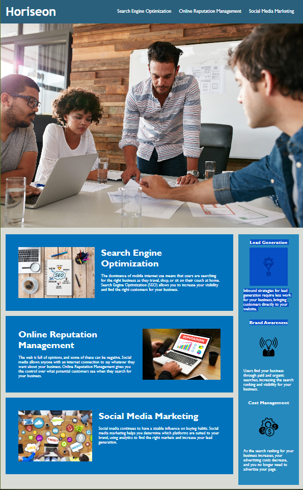

# Horiseon Accessibility Standards

## Description
A HTML, CSS, Git challenge; working to make current webpage optimized for search engines by following accessibility standards.
- Within this project, we review accessibility issues when viewing the webpage in smaller screens.

## Mock-Up

## Deployment
https://develepor-dan.github.io/Code_Refractor/

## Credits
mdn web docs - sting.fromCharCode()
-  https://developer.mozilla.org/en-US/docs/Web/JavaScript/Reference/Global_Objects/String/fromCharCode

w3schools - HTML Unicode (UTF-8) Reference
-  https://www.w3schools.com/charsets/ref_html_utf8.asp

mdn web docs - Array.from()
-  https://developer.mozilla.org/en-US/docs/Web/JavaScript/Reference/Global_Objects/Array/from